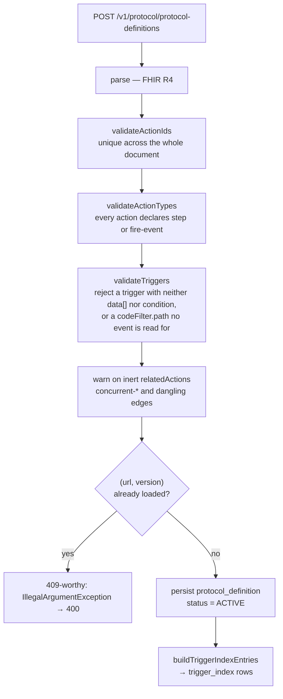

# Architecture & Design — Protocol Service

> The definitional plane: what a protocol *is*, before any patient or event exists.

System-wide context — why the services are split, how they coordinate, the shared schema — lives in
the **cce-common-util** repository's
[Architecture Overview](../../cce-common-util/docs/architecture-overview.md). This document covers
only what is specific to this service.

---

## 1. Responsibility

This service is the sole writer of the definitional tables. It does three things:

1. **Accepts and validates** FHIR R4 PlanDefinition and ActivityDefinition resources.
2. **Derives the trigger index** — the inverted index the Matcher Service uses for structural event
   matching.
3. **Manages their lifecycle** — active, retired, deleted.

It does not process events, enrol patients, create steps, or evaluate anything at runtime. Its
traffic is measured in loads per month.

```
Protocol author ──REST──> Protocol Service ──> protocol_definition
                                          ──> action_definition
                                          ──> trigger_index
```

## 2. Why a load is the expensive moment

Everything this service does is arranged so that runtime is cheap. A definition is parsed, validated
and indexed **once**, at load; the Matcher Service then matches events with an index lookup rather
than by interpreting FHIR on the hot path.

That makes load-time validation the only place a broken definition can be caught, so
[`loadProtocol`](#3-load-pipeline) rejects rather than warns wherever a definition could not possibly
work.

## 3. Load pipeline



Validation happens **before** the duplicate check and before any write, so a malformed definition
never leaves a partial row behind.

### Rejections versus warnings

| Condition | Outcome | Why |
|---|---|---|
| Duplicate action id | reject | Sub-steps are flattened to peers, so ids must be unique document-wide or two steps collide |
| Missing or unknown action type | reject | An untyped action cannot be classified as a step or an intelligence action |
| Trigger with neither `data[]` nor condition | reject | Matches nothing — it would be stored as an action that can never fire |
| Unknown FHIR resource type in a trigger | reject | Would create an index row no inbound event could match |
| `codeFilter.path` outside [`TriggerPath`](../../cce-common-util/docs/data-dictionary.md#9-trigger_index) | reject | Same failure, one level down: the row is indexed and never matched, and since **every** codeFilter of an action must match, one such path disables the action rather than narrowing it. A protocol that loads cleanly and silently never enrols anyone is worse than one that is refused |
| `concurrent-*` relatedAction | **warn** | Establishes no ordering; previously accepted, so rejecting would break an upstream publisher |
| `relatedAction` naming an unknown action | **warn** | Same |
| Body that the FHIR parser accepts but Jackson cannot re-read | reject | Nothing storable — fails rather than persisting an empty definition body |

The two warning cases are logged at load and are otherwise inert at runtime. The direction rules that
make an edge meaningful are in
[FHIR Conformance §1](../../cce-common-util/docs/fhir-conformance.md#1-relatedaction-direction).

## 4. The trigger index

`buildTriggerIndexEntries` flattens each action's `data[]` triggers into rows keyed by
`(resource_type, path, code_system, code_value, protocol_definition_id, action_id)` — the exact tuple
the Matcher Service looks up per inbound event.

The parser returns persistence-agnostic `TriggerIndexEntry` records and this service maps them onto
`TriggerIndex` rows. That keeps the parser usable by services that never write the table, and keeps
the only writer of `trigger_index` in one place.

**Condition-only triggers are not indexed here.** A trigger with a condition but no `data[]` has no
structural tuple to index; the Matcher Service holds those in memory and evaluates them per event.
This service stores them only as part of the definition JSON.

Column-level detail: [Data Dictionary §9](../../cce-common-util/docs/data-dictionary.md#9-trigger_index).

## 5. Lifecycle

| Operation | Effect |
|---|---|
| **Load** | `status = ACTIVE`, trigger index built |
| **Retire** | `status = RETIRED`, **trigger index rows deleted** |
| **Rebuild index** | index rows deleted, definition re-parsed from storage, rows rebuilt |
| **Delete** | index rows deleted, then the definition — blocked if patients are enrolled |

Retiring deletes the index rows rather than filtering on status at match time. The Matcher Service's
hot path is an index lookup; making it join to `protocol_definition` to check status would add work
to every inbound event to serve an operation that happens monthly. Absence from the index *is* the
retirement.

**Rebuild index** exists because the index is derived data. If a parser change alters how a
definition indexes, the stored definitions are still correct but their rows are stale, and rebuilding
is cheaper and safer than re-loading every protocol by hand.

### Deleting an enrolled definition

`protocol_instance.protocol_definition_id` is a foreign key into `protocol_definition`, and that
constraint is what blocks the delete. The service flushes inside a try/catch and translates
`DataIntegrityViolationException` into `IllegalStateException` → **409**.

The alternative — pre-checking `protocol_instance` before deleting — was removed deliberately. That
table belongs to the Matcher Service, and a service that reads another's tables to make its own
decisions is a boundary violation that also races: a patient could enrol between the check and the
delete. The foreign key cannot race.

## 6. Cache invalidation contract

The Matcher Service holds a parsed, derived form of each definition in memory
([`ParsedProtocolCache`](../../cce-common-util/docs/library-reference.md#parsedprotocolcache)). This
service does not notify it — there is no call and no event.

Instead the Matcher Service **polls** for definitional changes and evicts what it finds. The
consequence is a bounded staleness window: after a load, retire or rebuild here, the Matcher Service
takes up to its refresh interval to notice. That is the deliberate trade — a push would make an
inbound clinical event's correctness depend on this service being reachable.

Operationally: a newly published protocol does not begin matching the instant the `201` returns.

## 7. Observability

Two gauges, both about definitional content this service can actually move:

| Metric | Meaning |
|---|---|
| `cce.protocol.definitions.active` | `ACTIVE` protocol definitions available for matching |
| `cce.action.definitions.active` | `ACTIVE` action definitions available for resolution |

Event-processing and matching counters belong to the services that do that work and are registered
there, so a scrape of this service never reports a metric it cannot influence.

A retired definition is still a row but is no longer matchable, so it is deliberately not counted.

## 8. Persistence

Owns the DDL for three tables — `protocol_definition`, `action_definition` and `trigger_index` — in a
single Flyway migration, tracked in its own ledger (`flyway_schema_history_protocol`).

It once also owned `audit_log`; that table was dropped in 2.0.0, so this service now writes no audit
rows and the protocol lifecycle is traceable through the service logs and the definition rows' own
`status` and `updated_at`.

Being first in the deployment order is not incidental — the Matcher Service's migration declares
foreign keys into `protocol_definition`. See
[Data Dictionary §3](../../cce-common-util/docs/data-dictionary.md#3-ownership).

## 9. Security

No authentication is enforced at the application layer; these are internal endpoints expected to sit
behind the gateway service. Nothing records who made a change either: `audit_log` was dropped in
2.0.0 and actor attribution has not yet landed on the definitional tables, so a load or a retirement is
currently traceable only through the application log.

The write surface is worth noting when placing this service on a network: a caller who can reach
`POST /v1/protocol/protocol-definitions` can change what every patient in the system is measured
against.
